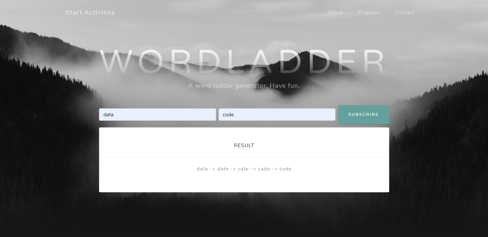

# backend-technology-course
A repo for homework of SE418 and SE420.

## 1. Word ladder
A spring boot app of a word-ladder generator. See more details in /word-ladder/README.md

## 2. Tasks
### 2.1 Task1
Invesgating the use of "F12" in browsers.

### 2.2 Task2

Explore the cpu and memory consumption of Word Ladder backend.

### 2.3 Task3

Deploy the word-ladder app onto Docker.

### 2.4 Task4

Divide the word-ladder project into two Microservice: the log-in component and the word-ladder generator component and dockerize them. 