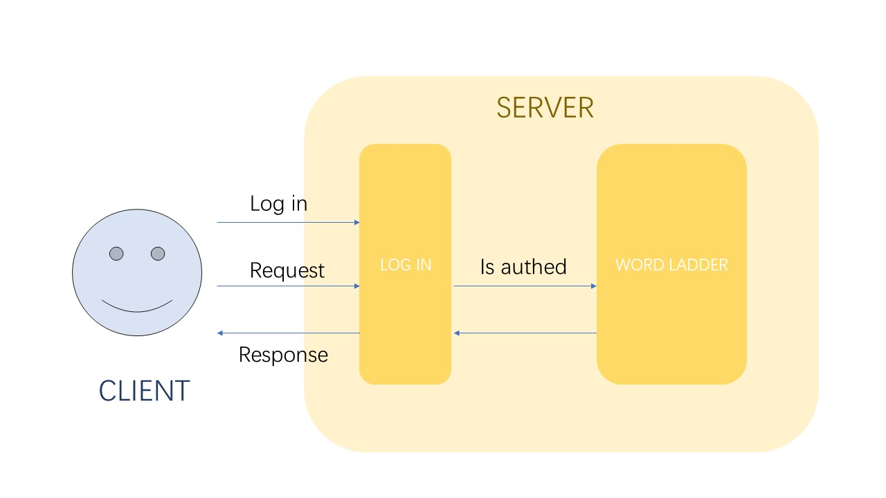

# Task4 Microservice exercise

## Part 1 Dockerize the tow springboot microservice
### Structure


## Part 2 Run the docker containers
```shell
docker pull dianaaaa/word-ladder:v1
docker pull dianaaaa/login:v1

# wait some seconds

docker run -itd -P --name=wordladder dianaaaa/word-ladder:v1
docker run -itd -p 8080:8000 --link=wordladder:wordladder dianaaaa/login:v1
```

### Then use post man to get the word ladder:
http://localhost:8080/login  
Method: POST
Body: username:user password:123456

http://localhost:8080/ask/{word1}/{word2}
Method:GET

### Use the react frontend
```shell
cd word-ladder-frontend
npm start
```

Then use browser to explore!

