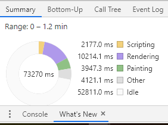
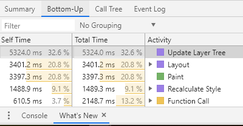
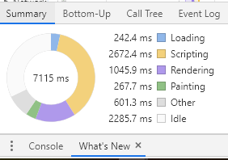
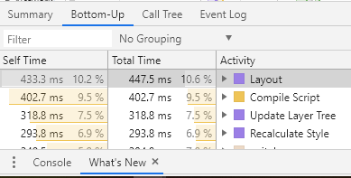

# The functionality of 'F12' in the browser
Here we mainly use the most popular browser, Chrome, as an example, and does not cover other browsers.

This article contains two parts. In part 1, we briefly introduce the usage of 'F12' in Chrome. And in part 2, we use these technology to see how the web page of SJTU can be improved.

## 1. F12 in chrome

### 1.1 What will we see after pressing 'F12' in Chrome?
Once we press 'F12' when we are using Chrome to surf on an web page, for example https://github.com. We will see nine tabs on the window.

- **Element**: This will display all the DOM elements of this page. If your mouse are hovering on a element, you can figure out the corresponding part rendered in this page, which makes us easy to understand each element of the page. And you can also see css styles of these elements. You even can modified the css when browsing. There are also some other messages, but I seldom use them.
- **Performance**: This can help you check your web page's performance. You have can test either the reloading performance or the performance in a stationary state. After recording the performance, it will provide a Pie chart showing the portion of time on different aspect.
- **Console**: In this section, some message generated by Javascript will be showed. It can help us figure out why this page is not working, or make it easy to debug by using "console.log".
- **Source**: In this section, you can modify your CSS or Javascript of this page, and even debug using breakpoint or so. In this 'page' sub-section, we can also find all the files accessable.
- **Network**: This will show informations pf network requests. When you are developing apps that using network requests to connect with each other, you can use this section to see how is your app works.
- **Others**: We seldom use the other sections when developing. So I will just skip them.

### 1.2 When will we use it?
-  **Debugging**: When we are debugging our web apps, we hope to see the status of them. In this situation, 'F12' is the best choice. We can not only use the console to log some message, or use Sources to debug with some advanced debugging tools, such as breakpoints.
-  **Front-end developing**: When we are developing front-end projects, we usually need to change the styles of elements. In the Elements section or Sources section, we can modify the css code and see the results in realtime. This is very convenient.
-  **Writing web crawler**: Sometimes we need to use web crawlers to get some specific information from the web pages. And we need the information of the elements which contain things we want to crwal. In this situation, we use the Elements section to find these informations.
-  **Finding ways to improve our pages**: As I mentioned above, there is a section called 'Performance', which help us to get insight of our pages' performance. We can see which part is the most consuming according to the Pie chart provided.

## 2. Find ways to improve [the home page of SJTU](https://www.sjtu.edu.cn/)
### 2.1 Explore the Performance
- Recoard

We use 'Record' first to see the performance in the stationary state. We can see that the rendering is the most consuming part in this situation. And the most consuming activity is 'Update Layer Tree' and 'Layout'.
- Profiling and Reload

Then we reload the page and record the performance. From the Pie chart we see that in this situation, Scripting becomes the most consumming aspect, and the Layout activity ranks the first.

### 2.2 Conclusion
From 2.1, we see that Rendering's portion of time consumed remainds almost the same. And it turns out that activities concerned with Rendering rank higher in the Bottom-Up sub-section. 

So I think we can imporve this page mainly by improving the front-end. And do what we can with other aspects.