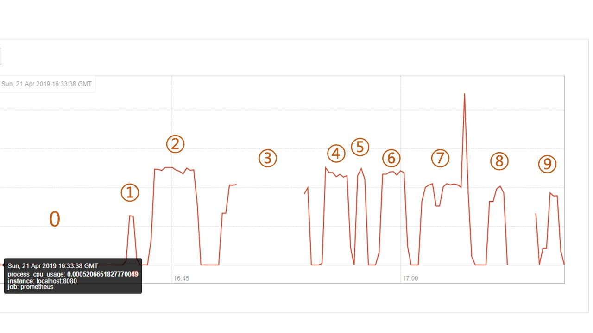
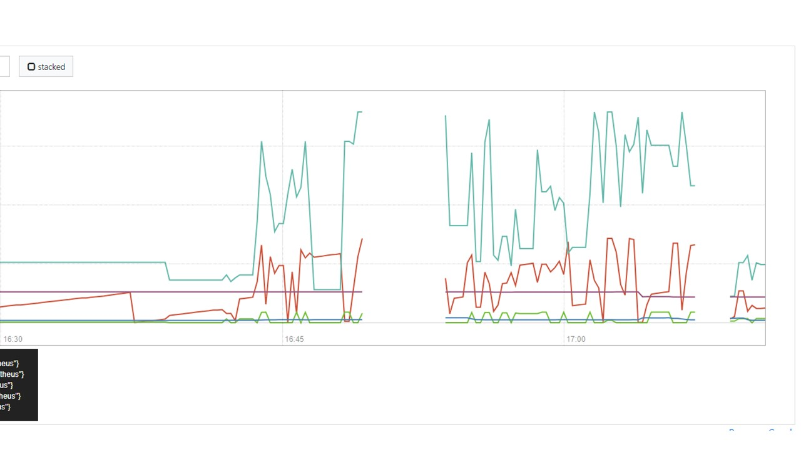

# The Resources Consumption Report of Word Ladder
## Part 1 Explore with prometheus and JMeter
Prometheus is an open-source systems monitoring and alerting toolkit. It can visualize the resources consumption data of a web project. Here we use its server to scrape and store time series data and its client to display these data models.

JMeter is an open-source software designed to load test functional behavior and measure perfomance. We can use it to simulate a group of users sending requests to our server.

Combine the two tools to test the resource consumption. Here is the results.

| Number | Users | Requests | time|
| ------ | ------ | ------ | ------ |
|0|0|0|---|
|1|1|100|0:33s|
|2|10|100|2:58s|
|3|20|100|Out of Memory|
|4|5|100|1:33s|
|5|5|50|0:43s|
|6|10|50|1:34s|
|7|20|50|Out of Memory|
|8|20|10|0:54s|
|9|2|100|0:51s|

When the number of users and the number of requests are large, there will occurs the  Out-of-Memory error.

## Part 2: Conclusion
By compirinig the table and two images above, we can make conclusions:

- When there is no request, cpu consumption is close to 0 and memory consumption is a horizontal line. 
- When there are x users who each sends 100 requests, cpu consumption will increase as x grows. But the gradient is small and will decrease as x grows. After x is larger than 10, the cpu comsuption is almost the same. The trend of memory consumption is the same.
